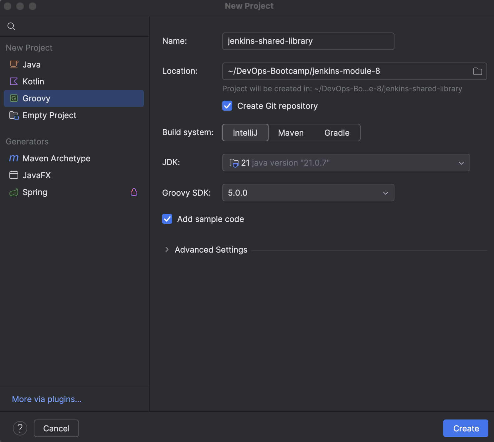
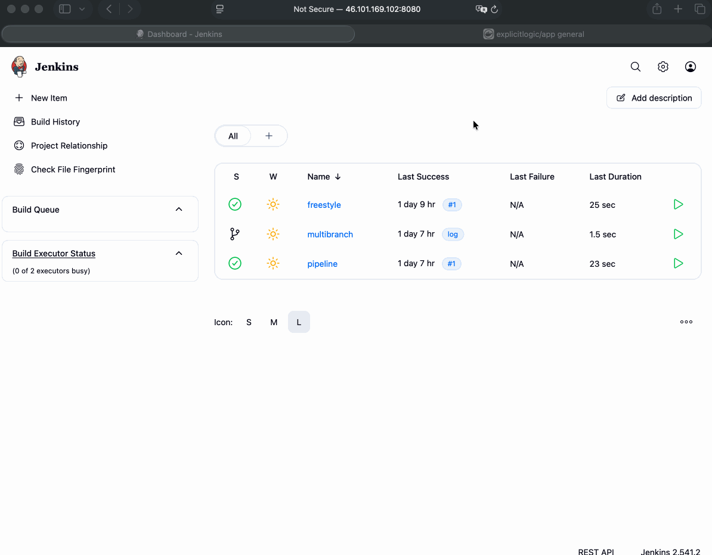
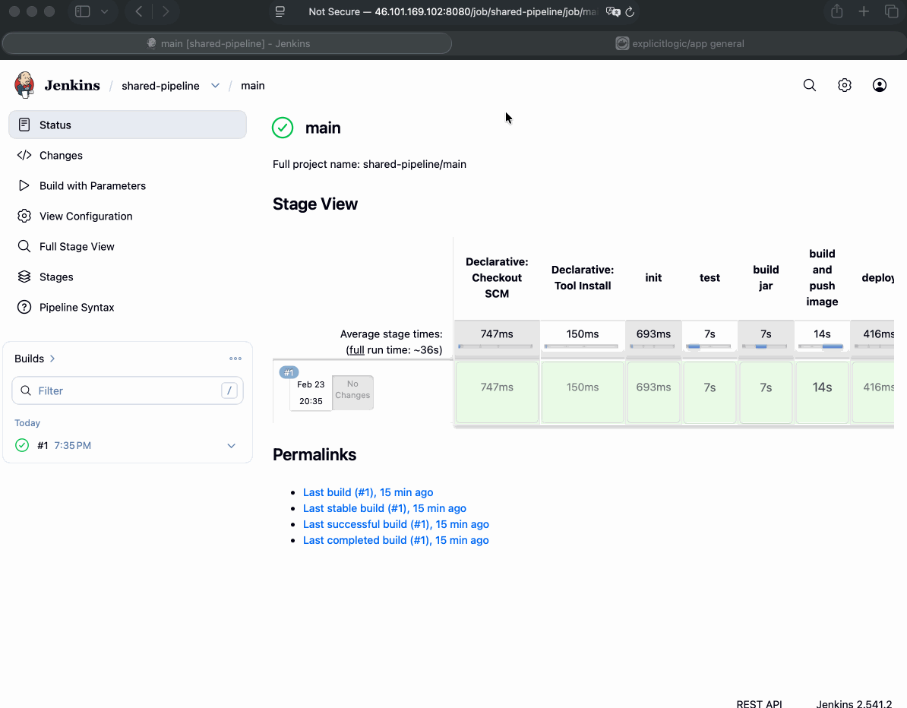

# Module 8 - Build Automation & CI/CD with Jenkins

This repository contains a demo project created as part of my **DevOps studies** in the **TechWorld with Nana – DevOps Bootcamp**.

https://www.techworld-with-nana.com/devops-bootcamp

***Demo Project:*** Create a Jenkins Shared Library

***Technologies used:*** Jenkins, Groovy, Docker, Git, Java, Maven

***Project Description:*** 

Create a Jenkins Shared Library to extract common build logic:

- Create separate Git repository for Jenkins Shared Library project
- Create functions in the JSL to use in the Jenkins pipeline
- Integrate and use the JSL in Jenkins Pipeline (globally and for a specific project in Jenkinsfile)

---

### Step 1 — Create a Separate Git Repository for the Jenkins Shared Library

Create a new Git repository to host the shared library code.

| Field | Value |
|-------|-------|
| Name | `jenkins-shared-library` |
| Repository URL | `https://github.com/explicit-logic/jenkins-shared-library` |



---

### Step 2 — Make the Shared Library Available Globally

Register the library in Jenkins so all pipelines can reference it.

1. Navigate to **Manage Jenkins** → **System** → **Global Trusted Pipeline Libraries**
2. Click **Add** and fill in the following fields:

| Field | Value |
|-------|-------|
| Name | `jenkins-shared-library` |
| Default version | `main` |
| Retrieval method | `Modern SCM` |
| Source Code Management | `Git` |
| Project Repository | `https://github.com/explicit-logic/jenkins-shared-library` |
| Credentials | `github` |

3. Click **Save**.

---

### Step 3 — Integrate and Use the JSL in a Jenkins Pipeline Globally

#### 3.1 Create a Multibranch Pipeline Job

1. From the Jenkins dashboard, click **New Item**
2. Set **Name** to `shared-pipeline`
3. Select **Multibranch Pipeline** as the type
4. Click **OK**

#### 3.2 Configure Branch Sources

Under **Branch Sources**, click **Add source** → **Git** and fill in:

| Field | Value |
|-------|-------|
| Project Repository | `https://github.com/explicit-logic/jenkins-module-8.3` |
| Credentials | `github` |

Click **Save**. Jenkins will automatically scan the repository and create jobs for every branch containing a `Jenkinsfile`.

#### 3.3 Run the Job

Click **Build with Parameters** and provide the following:

| Parameter | Example Value |
|-----------|---------------|
| `DOCKER_IMAGE` | `<docker_username>/app` |



---

### Step 4 — Integrate the JSL for a Specific Project in the Jenkinsfile

This approach embeds the library reference directly in the `Jenkinsfile`, removing the need for a global configuration. This is useful when you want the pipeline to be fully self-contained and portable.

1. Navigate to **Manage Jenkins** → **System** → **Global Trusted Pipeline Libraries**
2. **Remove** the `jenkins-shared-library` entry added in Step 2
3. Open your `Jenkinsfile` and replace `@Library('jenkins-shared-library')` with the following block:

```groovy
library identifier: 'jenkins-shared-library@main', retriever: modernSCM([
  $class: 'GitSCMSource',
  remote: 'https://github.com/explicit-logic/jenkins-shared-library',
  credentialsId: 'github'
])
```

4. Commit the change and run the job again


